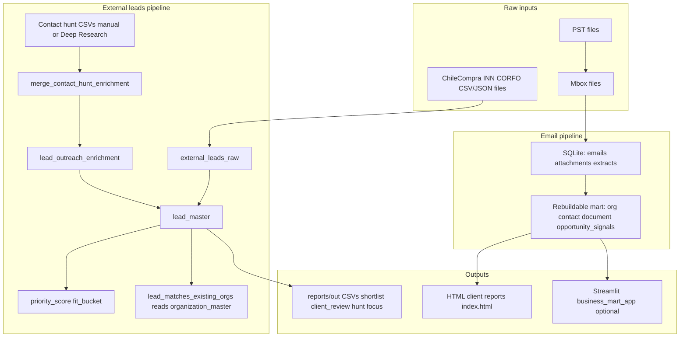

# 1. Executive summary

**What this project currently is:** A **local-first Python pipeline** that (a) ingests historical email from PST → mbox → **SQLite** → optional JSONL/ML, and builds a **business mart** on top of the archive; and (b) runs a **separate external-leads workflow** (Chile public sources) into the **same SQLite file**, with scoring, matching to the mart, enrichment storage, and many **CSV/HTML report outputs** under `reports/out/`. Code and docs live in the repo; real PSTs and the live DB default **outside** the repo (`~/data/origenlab-email/` per `.env.example`).

**Main business purpose:** Turn raw email and public procurement/lab listings into **actionable commercial intelligence**: who you already know (`organization_master` / `contact_master`), which **new** opportunities matter (`lead_master`), and packaged **client-facing analytics** (HTML reports, summaries) plus operational sheets for outreach.

**Old email archive vs external leads:**

| Layer | Role | Primary tables |
|--------|------|----------------|
| **Email archive** | Immutable-ish **conversation memory** (messages, attachments, extracts) | `emails`, `attachments`, `attachment_extracts` |
| **Business mart (derived from archive)** | **Org/contact rollups** for CRM-style views | `organization_master`, `contact_master`, `document_master`, `opportunity_signals` |
| **External leads** | **Net-new opportunities** from files/API-less ingest | `external_leads_raw` → `lead_master` → `lead_matches_existing_orgs`, `lead_outreach_enrichment` |

Leads code **reads** `organization_master` for matching; it does **not** rewrite archive or mart tables.

**Is the architecture conceptually sound?** **Yes at the database level:** clear split between raw email, rebuildable mart, raw lead blobs, normalized leads, match edges, and optional JSON enrichment. **Messy at the artifact layer:** many overlapping CSVs (EN/ES, full dump vs shortlist vs hunt vs merged), some exports **without stable lead IDs**, and operational files that can **drift** if regenerated at different times—so “source of truth” is easy to confuse for humans even when SQLite is consistent.

**Most important conclusions (7):**

1. **Canonical truth for leads is SQLite** (`lead_master.id`, `external_leads_raw`, `lead_outreach_enrichment`), not any CSV.
2. **Canonical truth for “who we know” from email is the mart** (`organization_master.domain`, `contact_master.email`), rebuilt from archive pipelines—not the lead CSVs.
3. **`reports/out/archive/leads_export*.csv` (~130k lines each)** are **audit-scale projections**, not weekly operational truth; they overload the mental model.
4. **`id_lead` appears in weekly focus and contact-hunt paths** but **not** in `export_leads_shortlist.py` / `export_leads_spanish_csvs.py` outputs—**CSV-only workflows cannot reliably join** shortlist/client review back to `lead_master` without fuzzy keys or the DB.
5. **Observed workspace issue:** `leads_contact_hunt_current.csv` and `leads_contact_hunt_current_merged.csv` in this repo can contain **different populations of `id_lead`** (e.g. first row `608694` vs `6`)—treating merged as authoritative without re-merge is **unsafe**.
6. **`lead_outreach_enrichment` stores a JSON snapshot** of hunt-row fields; provenance is `source_file` + `updated_at`—good for import, but **easy to lose lineage** if people only pass spreadsheets around.
7. The repo **already** has credible **non-spreadsheet client delivery** for the **email** side (timestamped `index.html` + `summary.json` + `ALCANCE_INFORME.md`); the **leads** side is still CSV-centric in v1 docs.

**Implementation update (2026-03):** The lead-side gaps called out above (missing `id_lead` on several exports, hunt current vs merged drift risk, and CSV-heavy client handoff) were addressed with a narrower `reports/out/active/` contract, `validate_contact_hunt_alignment.py` + optional `--require-aligned-with` on import, `id_lead` on shortlist/client-review/full exports, and a static **client pack** generator (`scripts/reports/build_leads_client_pack.py` → `reports/out/client_pack_latest/`). Operational layout is documented in [REPORTS_AND_CLIENT_PACK.md](REPORTS_AND_CLIENT_PACK.md) and in the canonical outputs section of [LEAD_PIPELINE.md](LEAD_PIPELINE.md).

---

# 2. Current system map

This is the end-to-end picture for a **non-technical** reader.

**Raw inputs:** PSTs (converted to mbox), mbox files, and **local** ChileCompra / INN / CORFO files (no live crawler in v1).

**Normalization:** `external_leads_raw` holds `raw_json` per `(source_name, source_record_id)`; `normalize_leads.py` fills **`lead_master`** (org, contact, domain, region, evidence, etc.).

**Scoring:** `leads_score.py` writes **`priority_score`**, **`priority_reason`**, **`fit_bucket`** on `lead_master`.

**Matching:** `match_leads_to_mart.py` compares leads to **`organization_master`** (domain, then normalized name) and inserts **`lead_matches_existing_orgs`** (`already_in_archive_flag`, `matched_domain`, etc.). Read-only on the mart.

**Enrichment:** Humans or tools fill **Spanish hunt CSVs**; `merge_contact_hunt_enrichment.py` merges into a **merged CSV**; `import_contact_hunt_to_sqlite.py` loads **`lead_outreach_enrichment`** (full row as JSON) and optionally promotes procurement contact fields into **`lead_master`**.

**CSV / report outputs:** Many files under `reports/out/active`, `archive`, `reference`, plus **timestamped folders** (`20260317_*`) with **HTML email analytics** and JSON summaries.

**Apps / dashboards:** **`apps/business_mart_app.py`** (Streamlit) explores mart tables; **`scripts/leads/run_contact_hunt_web_server.py`** serves **`leads_*.csv` over HTTP** with basic auth (no direct SQLite exposure).

**Where the old email DB fits in:** It is the **foundation** for “already in archive” and for **client HTML reports** about mail volume, classifications, equipment, domains. The lead pipeline **layers on top** of the same DB file and **asks** the mart whether a lead’s org is already known.

---

# 3. Source-of-truth audit

For each important artifact, **name → role → location → canonical vs derived → safe to edit manually → keep in future architecture?**

### SQLite (single DB, path from `ORIGENLAB_SQLITE_PATH`)

| Name | Role | Canonical? | Manual edit? | Future |
|------|------|--------------|--------------|--------|
| `emails` | Raw message store | **Canonical** for archive body/metadata | No (re-ingest strategy) | Keep |
| `attachments` / `attachment_extracts` | Binary + text extract sidecar | **Canonical** for attachment facts | No | Keep |
| `contact_master` / `organization_master` / `document_master` / `opportunity_signals` | **Derived mart** | **Canonical derived** (rebuild from pipeline) | Avoid ad-hoc; rebuild preferred | Keep |
| `external_leads_raw` | Immutable-ish raw fetch | **Canonical** for “what the file said” | No | Keep |
| `lead_master` | Normalized lead row + scores + workflow columns | **Canonical** for leads | Status/notes **can** be updated (intended); avoid hand-editing core identity fields without process | Keep |
| `lead_matches_existing_orgs` | Match edges | **Canonical derived** (re-run matcher) | Prefer re-run | Keep |
| `lead_outreach_enrichment` | Imported hunt / DR snapshot | **Canonical** for enrichment **after import** | Prefer re-import from controlled CSV | Keep |
| `lead_account_*` (optional) | Account rollup over many tenders | **Derived / rebuildable** | Rebuild scripts | Keep if you use account view |

### CSV and other files under `reports/out/`

| Name | Role | Canonical? | Manual edit? | Future |
|------|------|------------|--------------|--------|
| `reports/out/active/leads_weekly_focus.csv` | Top high/medium-fit slice with **`id_lead`** | **Derived** (SQL) | Regenerate; do not treat as master | Keep as **operational view** |
| `reports/out/active/leads_weekly_focus_summary_es.md` | Human-readable weekly status | **Derived narrative** | Edit for comms only; regen overwrites if scripted | Keep |
| `reports/out/active/leads_contact_hunt_current.csv` | Working hunt sheet | **Working copy** (not canonical) | **Yes** (intended) | Keep; **one** active base |
| `reports/out/active/leads_contact_hunt_current_merged.csv` | Merge of base + enrichment | **Derived** | Prefer edit **base** or **enrichment**, then re-merge | Keep only if **aligned** with current |
| `reports/out/active/leads_contact_hunt_for_deepsearch.csv` | Hunt + DB contact columns; optional filter | **Derived** | Regenerate | Keep as **tool input** |
| `reports/out/active/leads_active_unified.csv` | Focus columns + hunt tail by `id_lead` | **Derived** | Regenerate | Optional |
| `reports/out/active/leads_shortlist_es.csv` | Spanish shortlist | **Derived** | Low value to edit (no `id_lead`) | Keep if client needs; **fix ID in pipeline** long-term |
| `reports/out/active/leads_client_review_es.csv` | Spanish client comparison sheet | **Derived** | Same | Same |
| `reports/out/archive/leads_export.csv` (+ `_es`) | Full lead dump | **Derived / audit** | No | **Retire** from “active” mental model; archive OK |
| `reports/out/reference/*` | Experiments, DR fills, top-N slices | **Reference** | Unclear lineage | **Do not** treat as canonical |
| `reports/out/20*/index.html` + `summary.json` + `ALCANCE_INFORME.md` | Email analytics client pack | **Derived** | Regenerate | Keep as **email** client deliverable pattern |

### Explicit answers you asked for

- **Which SQLite tables are canonical?**  
  - **Archive truth:** `emails`, `attachments`, `attachment_extracts`.  
  - **Archive-derived truth (rebuildable):** mart tables.  
  - **Lead truth:** `external_leads_raw` + `lead_master`.  
  - **Match layer:** `lead_matches_existing_orgs`.  
  - **Enrichment layer:** `lead_outreach_enrichment`.  
  - **Reporting layer:** there is no separate reporting table—reports are **files**.

- **Which CSVs are projections/views?**  
  Essentially **all** CSVs under `reports/out/` are **views** of SQLite (or merges of those exports), except **reference** files that may mix manual research outputs.

- **Which files are redundant or legacy?**  
  EN duplicates archived by `prepare_active_workspace.py`, full `leads_export*.csv`, old `leads_contact_hunt_es.csv` copies under `archive/active_cleanup_*`, multiple `reference/*DEEPRESEARCH*` variants.

- **Is any CSV acting as a fake database?**  
  **Yes, operationally:** **`leads_contact_hunt_current_merged.csv`** and sometimes **`leads_client_review_es.csv`** invite “edit the spreadsheet = truth.” **Truth should be** `lead_master` + `lead_outreach_enrichment` after **import**. **`leads_shortlist_es.csv` / `leads_client_review_es.csv`** without `id_lead` are especially poor as pseudo-databases because rows are hard to key back to SQLite.

---

# 4. Database audit

### 4.1 Old email archive and mart

| Table | Purpose | Key columns | Join keys | Layer | Notes |
|-------|---------|-------------|-----------|--------|--------|
| `emails` | One row per message | `id`, `message_id`, `sender`, `date_iso`, body fields | `attachments.email_id`, `document_master.email_id` | **Archive truth** | Full refresh clears `emails` on re-import per README |
| `attachments` | Parts / files | `email_id`, `sha256`, `saved_path` | → `emails.id` | **Archive truth** | |
| `attachment_extracts` | OCR/text extract metadata | `attachment_id`, `extract_status`, `text_preview` | → `attachments.id` | **Archive truth** | |
| `contact_master` | Per-email contact rollup | `email` PK, `domain`, counts, `top_equipment_tags` | `email`; `domain` → `organization_master.domain` | **Reporting / archive-derived** | |
| `organization_master` | Per-domain org rollup | `domain` PK, `organization_name_guess`, `key_contacts`, activity counts | `domain` | **Reporting / archive-derived** | **Primary bridge** for lead matching |
| `document_master` | Attachment-level doc typing | `attachment_id` PK, `sender_domain`, `doc_type`, previews | `email_id` → `emails` | **Reporting / archive-derived** | |
| `opportunity_signals` | Scored signals | `entity_kind`, `entity_key`, `signal_type`, `details_json` | `entity_key` = email or domain | **Reporting / archive-derived** | |

**Duplicated concepts:** Org facts appear in both **`organization_master`** and denormalized fields on **`contact_master`** (`organization_name_guess`)—by design for convenience; **weak join** if `contact_master.domain` is null or dirty.

**Provenance:** Mart is **rebuildable**; individual columns do not carry “which email proved this” except indirectly via counts and linked tables.

### 4.2 Lead pipeline and optional accounts

| Table | Purpose | Key columns | Join keys | Layer | Notes |
|-------|---------|-------------|-----------|--------|--------|
| `external_leads_raw` | Raw source rows | `source_name`, `source_record_id`, `raw_json`, `fetched_at` | UNIQUE `(source_name, source_record_id)` | **Lead truth (raw)** | |
| `lead_master` | Normalized lead | `id` PK, `org_name`, `domain`, scores, `status`, `notes`, … | `id` → all lead FKs | **Lead truth (normalized)** | `source_record_id` links back to raw conceptually |
| `lead_matches_existing_orgs` | Link to archive org | `lead_id`, `matched_domain`, `match_type`, `confidence_score`, `already_in_archive_flag` | `lead_id` → `lead_master.id`; `matched_domain` → `organization_master.domain` | **Match layer** | Multiple rows possible; exporters often pick **one** (MIN `id`) |
| `lead_outreach_enrichment` | Post-import enrichment | `lead_id` PK, `enrichment_json`, `source_file`, `updated_at` | `lead_id` | **Enrichment layer** | JSON mirrors hunt columns |
| `lead_account_master` + `lead_account_membership` + `lead_account_matches_existing_orgs` + aliases + overrides | CRM-style **account** over many tenders | `lead_account_master.id`, `account_dedupe_key`, `lead_id` on membership | `lead_id` → `lead_master`; org match on **domain** text | **Derived rollup** | **Rebuild** with `build_lead_account_rollup.py`; separate from tender-level truth |

**Duplicated concepts:**  
- **`lead_master.domain`** vs **`organization_master.domain`** (same idea, different universes).  
- **Spanish hunt columns** vs **`lead_master`** English-ish column names—same entity, two languages.  
- **`lead_matches_existing_orgs`** vs **`lead_account_matches_existing_orgs`** (tender-level vs account-level)—both valid; **naming** requires care.

**Missing provenance:** `lead_master` does not store a persistent pointer to `external_leads_raw.id` (only `source_name` / `source_record_id`); acceptable but weaker for audits.

**Weak joins / denormalization risk:** Exporters that take **“first”** match row can hide ambiguity if multiple `lead_matches_existing_orgs` exist. Promoting contact fields from hunt into **`lead_master`** can **overwrite** if normalize re-runs without care—docs note preservation when raw has empty contact fields.

---

# 5. Output files audit

Line counts below are **as of this audit** in the workspace (header included in `wc -l`).

### 5.1 Active outputs (`reports/out/active/`)

| File | Lines (approx) | What it is for | Key columns (abbrev.) | Audience | Verdict |
|------|----------------|----------------|------------------------|----------|---------|
| `leads_weekly_focus.csv` | 151 | Weekly prioritized slice (high/medium fit, top N) | `id_lead`, `fit_bucket`, `priority_score`, `org_name`, `buyer_kind`, tags, `already_in_archive_flag`, `source_url`, `evidence_summary`, `status`, `next_action` | Internal ops | **Stay** — regenerable via `run_weekly_focus.py` |
| `leads_weekly_focus_summary_es.md` | n/a | Explains canonical files, DB counts, warnings | Markdown sections | Internal / client skim | **Stay** |
| `leads_contact_hunt_current.csv` | 201 | Full Spanish hunt template + derived hints | `id_lead`, `organizacion_compradora`, tags, URLs, manual contact fields, workflow cols | Internal ops, GPT-assisted research | **Stay** — **the** editable working sheet |
| `leads_contact_hunt_current_merged.csv` | 201 | Base + DR/manual merge | Same as hunt | Import pipeline | **Stay but only if regenerated from current base**; **right now misaligned risk** (see §6) |
| `leads_contact_hunt_for_deepsearch.csv` | 201 | Hunt + `tiene_contactos_en_db`, etc.; can exclude orgs with contacts | Hunt cols + DB check columns | GPT / Deep Research input | **Stay**; regen via `prepare_active_workspace.py --deepsearch` |
| `leads_active_unified.csv` | 151 | Weekly focus + hunt detail joined on `id_lead` | English focus + Spanish hunt tail | Internal | **Optional stay** — convenient but **wide / redundant** |
| `leads_shortlist_es.csv` | 201 | Spanish shortlist | `ajuste`, `puntaje`, `organización`, … **no `id_lead`** | Client / internal | **Stay** short-term; **add `id_lead`** in pipeline when possible |
| `leads_client_review_es.csv` | 251 | Spanish “why this lead + archive context” | Archive comparison cols + lead fields; **no `id_lead`** | Client review | **Stay**; **add `id_lead`** when possible |

### 5.2 Archive outputs (`reports/out/archive/`)

| File / folder | Lines (approx) | What it is for | Audience | Verdict |
|---------------|----------------|----------------|----------|---------|
| `leads_export.csv` | ~130,158 | **Full** `lead_master` export (+ match join) | Audit / one-off analysis | **Retire** from routine use; **keep archived** if disk OK |
| `leads_export_es.csv` | ~130,158 | Spanish headers for full export | Same | Same |
| `active_cleanup_20260320_203000/*` | ~201 each | Moved duplicates: EN shortlist/review, `leads_contact_hunt_es.csv`, `*_con_db`, `*_netnew_*` | Historical | **Keep** as archive; **do not** use as current |
| `leads_client_review.csv`, `leads_shortlist.csv` (in cleanup folder) | 251 / 201 | English counterparts | Internal | Archived by design |

### 5.3 Reference / experimental (`reports/out/reference/`)

| File | Lines | What it is for | Audience | Verdict |
|------|-------|----------------|----------|---------|
| `leads_official_contacts_top.csv` | 19 | Curated official contacts / notes | GPT / research / client snippet | **Reference** — **rename** in docs if reused; not pipeline output |
| `leads_contact_hunt_top_hosp_univ_netnew_es.csv` | 101 | Focused slice (hospital/university, net-new narrative) | Experiment | **Reference** |
| `leads_contact_hunt_top_hosp_univ_netnew_sin_contactos_db_es.csv` | 101 | Subset + “sin contactos en DB” style filtering | Experiment | **Reference** |
| `*_DEEPRESEARCH_FILLED_top10*.csv` | 101 / 11 | DR-filled examples, top-10 style | Experiment / training examples | **Reference** — **do not merge** blindly |
| `*_DEEPRESEARCH_enrichment_top10_emails.csv` | 11 | Slim enrichment keyed by `id_lead` | Merge input example | **Reference** |

### 5.4 Email-related report packs (`reports/out/20260317_*`)

| Artifact | Purpose | Audience | Verdict |
|----------|---------|----------|---------|
| `index.html` | Main **email** analytics report | Client / internal | **Stay** as **email** deliverable template |
| `summary.json` | Machine-readable metrics | Internal / tooling | **Stay** |
| `ALCANCE_INFORME.md` | Scope / methodology narrative | Client | **Stay** |

### 5.5 Explicit deep-dive on files you named

- **`leads_weekly_focus.csv`:** **Derived** from `lead_master` + one match row; **has `id_lead`**; default top **150** (`run_weekly_focus.py --top`). **Internal ops.**
- **`leads_contact_hunt_current.csv`:** **`export_contact_hunt_sheet.py`** (or copy renamed to “current”); **wide** Spanish sheet; **`id_lead` present**. **Working file** for research.
- **`leads_contact_hunt_for_deepsearch.csv`:** Produced from current hunt via **`export_contact_hunt_sheet_existing_contacts_check.py`** (`prepare_active_workspace.py --deepsearch`); adds DB-awareness columns; optional exclude when org already has contacts. **GPT/DR input.**
- **`leads_contact_hunt_current_merged.csv`:** **`merge_contact_hunt_enrichment.py`** output; must match **`id_lead`** set of base. **Import via `import_contact_hunt_to_sqlite.py`.**
- **`leads_active_unified.csv`:** **`prepare_active_workspace.py --unified`**; duplicates information (focus + hunt). **Internal convenience.**
- **`leads_shortlist_es.csv`:** From English shortlist through **`export_leads_spanish_csvs.py`**; **no `id_lead`.**
- **`leads_client_review_es.csv`:** Spanish mapping of **`export_client_review_csv.py`** output; **no `id_lead`** in current mapping.
- **Old email-related exports:** Timestamped **`index.html` / `summary.json` / `ALCANCE_INFORME.md`**; see `docs/OUTPUTS_OVERVIEW.md` and `scripts/reports/run_all_reports.py` (pattern). **Not** under `active/leads_*`.

---

# 6. Redundancy and confusion report

### Critical

1. **Missing `id_lead` on `leads_shortlist_es.csv` and `leads_client_review_es.csv`** — same entity appears in multiple CSVs with **no stable join key** back to `lead_master` without the DB or fuzzy matching.
2. **`leads_contact_hunt_current.csv` vs `leads_contact_hunt_current_merged.csv` population drift** — observed **different leading `id_lead`**; **merged must never be imported** without verifying alignment to the current base export.
3. **Spreadsheet-as-database behavior** — editing merged or client CSVs without re-import **does not update** `lead_outreach_enrichment` / `lead_master`.

### Medium

4. **Bilingual parallel columns** — e.g. `org_name` (focus) vs `organizacion_compradora` (hunt); increases width and merge mistakes.
5. **`leads_active_unified.csv` duplicates** scoring/fit concepts across English and Spanish columns.
6. **Multiple “canonical” narratives** — `docs/LEAD_PIPELINE.md` vs `prepare_active_workspace.CANONICAL_KEEP` vs human habit; mostly aligned but **easy to diverge**.
7. **Match row choice** — exporters use **one** `lead_matches_existing_orgs` row (MIN `id`); multiple matches are **hidden**.

### Low

8. **Duplicate EN/ES full exports** in archive (~130k lines × 2) — storage and “which file is open?” noise.
9. **Reference folder proliferation** — many similarly named `*top_hosp_univ*DEEPRESEARCH*` files; **high cognitive load**.

---

# 7. Recommended target architecture

**Minimal canonical SQLite (already close):**

- **Keep:** `emails`, `attachments`, `attachment_extracts`, mart tables, `external_leads_raw`, `lead_master`, `lead_matches_existing_orgs`, `lead_outreach_enrichment`.
- **Optional:** `lead_account_*` only if you actively use account rollups.

**Minimal operational CSV exports (target: 3–5 regenerable files):**

1. `leads_weekly_focus.csv` (+ `leads_weekly_focus_summary_es.md`)
2. **One** `leads_contact_hunt_current.csv` (working)
3. Optionally **`leads_contact_hunt_for_deepsearch.csv`** (regenerated as needed)
4. **One client-facing export** that **includes `id_lead`** (shortlist + client review merged in spirit if not in file count)

**Stable join-key policy:**

- **Always surface `lead_master.id` as `id_lead`** on any export that might be joined, merged, or imported.
- **Archive side:** join on **`organization_master.domain`** and **`contact_master.email`**.

**Provenance policy for enrichment:**

- Every import into `lead_outreach_enrichment` should record **`source_file`** and **`updated_at`** (already in schema); operationally, **keep the enrichment CSV** in version control or dated folder when possible.
- Prefer **idempotent merge rules** (current default: fill empty cells only).

**Folder structure (practical):**

- `reports/out/active/` — **only** current regenerable + one editable hunt base + aligned merged.
- `reports/out/archive/` — dated cleanups, full dumps.
- `reports/out/reference/` — experiments, **never** imported without review.

**Naming:**

- Suffix `_es` for Spanish client/ops copies; avoid keeping **both** EN and ES in `active/` (script already archives EN duplicates).

**Smallest change, biggest win:** Add **`id_lead`** to shortlist and client review exports (small code change post-audit) and **treat merged hunt as ephemeral** until re-generated from current base.

---

# 8. Client delivery recommendation

| Option | Effort | Credibility | Maintainability | Fit for this project |
|--------|--------|-------------|-----------------|----------------------|
| **Executive markdown/PDF + appendix** | Low–medium | High if tied to `summary.json` / DB counts | High (text in repo) | Good **narrative** layer; combine with HTML for email insights |
| **Appendix spreadsheets only** | Low | Low–medium (feels like “data dump”) | Poor (forked truth) | **Not recommended** as primary |
| **Streamlit dashboard** | Medium | Medium–high for **exploration** | Medium (must secure + host) | **Strong for internal**; already have `business_mart_app.py` |
| **HTML static report (email analytics)** | Medium (one command per batch) | **High** — charts, scope doc | High | **Already implemented** for **archive/mart** story |
| **Streamlit “leads” report** | Higher | High if polished | Medium | Planned v2 in docs—not shipped |
| **Static client review pack (HTML+MD+CSV appendix)** | Medium | **High** | High | **Best balanced** package |
| **Internal vs external** | Low extra | High | High | **External:** HTML + short MD + **minimal** CSV with IDs; **Internal:** SQLite + Streamlit + full exports |

**One best option for now:**  
**Ship a static “client pack”** patterned on existing email deliverables: **`index.html` + `ALCANCE_INFORME.md` + `summary.json`** for **archive-derived insights**, and for **leads** add a **short Spanish markdown executive summary** (same spirit as `leads_weekly_focus_summary_es.md` but client-toned) plus **one** CSV appendix that **includes `id_lead`** once the pipeline is adjusted—until then, disclose that **IDs are in the weekly focus / hunt files** and avoid handing only `leads_client_review_es.csv` as the sole artifact.

---

# 9. Concrete cleanup plan

### Phase 1: No-risk cleanup

- Run **`prepare_active_workspace.py`** (dry-run first) to ensure `active/` only holds intended names; archive stray `leads_*.csv`.
- **Regenerate** `leads_contact_hunt_for_deepsearch.csv` after `leads_contact_hunt_current.csv` is stable (`--deepsearch`).
- **Regenerate** `leads_active_unified.csv` only after focus + hunt align (`--unified`).
- **Delete or ignore** routine opening of `reports/out/archive/leads_export*.csv` for daily work.
- **Document** in a one-line README under `reports/out/active/` who owns the **current** hunt base file (optional micro-doc).

### Phase 2: Structural improvements

- **Add `id_lead` / `lead_master.id`** to `export_leads_shortlist.py`, `export_client_review_csv.py`, and **`export_leads_spanish_csvs.py`** mappings (requires code change).
- **Re-merge** `leads_contact_hunt_current_merged.csv` from the **current** `leads_contact_hunt_current.csv` + latest enrichment CSVs; **re-import** to SQLite.
- **Single script or Makefile target** “weekly_leads_outputs” that runs: weekly focus → export hunt → optional deepsearch → optional unified → Spanish CSVs.
- **Decide** whether `lead_account_*` is in scope; if not, keep docs but mark **optional**.

### Phase 3: Better client reporting / visuals

- **Template** a `leads_client_pack/` generator: copy MD summary + embed key charts (could be simple tables from SQL) into HTML **or** PDF via pandoc (optional).
- **Optional** Streamlit tab for leads (as docs already anticipate v2).
- **Do not** expose raw SQLite; use **read-only** exports or app.

---

# 10. Final recommendation

**If I had to simplify this project without breaking anything, I would** keep **one SQLite database** as the only source of truth, freeze **routine** outputs to **`leads_weekly_focus.csv` + `leads_weekly_focus_summary_es.md` + a single `leads_contact_hunt_current.csv`**, treat **`leads_contact_hunt_current_merged.csv` as strictly derived and short-lived**, stop using **full `leads_export*.csv`** for day-to-day work, and deliver clients **HTML + markdown narrative** (already proven for email) with **appendix data that always includes `id_lead`**, not “naked” spreadsheets.

**Decisive recommendation:** **Operational truth in SQLite; regenerable CSVs in `reports/out/active/`; client-facing story in HTML/Markdown; spreadsheets only as labeled appendices keyed by `id_lead`.**

---

### Appendix A: Canonical entities and keys

| Entity | Canonical table/file | Primary key | Safe join key | Notes |
|--------|----------------------|-------------|---------------|--------|
| Email message | `emails` | `id` | `message_id` (when non-null) | Re-ingest semantics per pipeline docs |
| Attachment | `attachments` | `id` | `email_id` + `part_index` | |
| Archive contact rollup | `contact_master` | `email` | `email`, `domain` | |
| Archive org rollup | `organization_master` | `domain` | `domain` | Lead match anchor |
| Raw lead record | `external_leads_raw` | `id` (surrogate) | `(source_name, source_record_id)` UNIQUE | |
| Normalized lead | `lead_master` | `id` | **`id` as `id_lead` in exports** | |
| Lead ↔ archive org match | `lead_matches_existing_orgs` | `id` | `lead_id`, `matched_domain` | May be multiple per lead |
| Outreach enrichment | `lead_outreach_enrichment` | `lead_id` | `lead_id` | JSON payload |
| Lead account (optional) | `lead_account_master` | `id` | `account_dedupe_key`, membership.`lead_id` | Rebuildable |

---

### Appendix B: Proposed “minimum viable outputs”

**Actively maintain (target: 4–5 artifacts):**

1. **`reports/out/active/leads_weekly_focus.csv`** — prioritized queue with **`id_lead`**.
2. **`reports/out/active/leads_weekly_focus_summary_es.md`** — operational + client-skimmable status.
3. **`reports/out/active/leads_contact_hunt_current.csv`** — single living working sheet for enrichment.
4. **`reports/out/active/leads_client_review_es.csv`** (or English equivalent) **once it includes `id_lead`** — primary “client appendix” row set; until then, pair **(3)** with focus file for IDs.
5. **Optional:** **`leads_contact_hunt_for_deepsearch.csv`** — only if Deep Research is part of the weekly rhythm.

**Retire from “weekly maintenance”:** full **`leads_export.csv` / `leads_export_es.csv`**, redundant **`leads_active_unified.csv`** unless you personally rely on it, and anything under **`reference/`** except as frozen examples.
