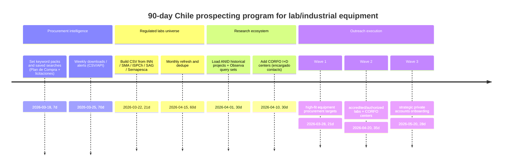

# Chile Prospecting Playbook for Laboratory and Industrial Equipment Buyers

## Executive summary

Chile is a high-leverage market for prospecting lab/industrial equipment because many high-value buyers are visible through **public procurement** and **official registries** (accreditations and sectoral authorizations). The fastest way to build a contactable, evidence-based prospect list is to combine: (1) procurement signals from **Mercado Público / ChileCompra** (tenders, purchase orders, annual purchase plans, and open-data downloads), and (2) “laboratories that must continually operate” from **INN**, **SMA (RETFA/ETFA)**, **ISPCh**, **SAG**, and **Sernapesca**. citeturn4search12turn6search8turn0search2turn0search3turn1search0turn1search5turn11view0

A practical operating model is:

- **Weekly**: monitor tender and purchase-order searches + download datasets; filter by Spanish keyword packs for your categories (balances, centrifuges, HPLC/chromatography, autoclaves, microscopes, pH meters, moisture analyzers). Mercado Público provides both public search and downloadable datasets, and ChileCompra provides an API that requires a ticket requested with Clave Única. citeturn6search2turn6search12turn0search5turn10search8  
- **Monthly/quarterly**: refresh official lab registries (INN accredited labs; SMA RETFA; SAG and Sernapesca authorized labs; ISPCh recognized labs) to generate stable “accounts to work.” citeturn0search6turn0search3turn11view1turn11view0turn1search0  
- **Always**: enrich each prioritized organization with a contact route (procurement office + technical/lab lead), using official contact pages where available (some registries expose manager email/phone directly, notably CORFO’s I+D center registry). citeturn5view2  

Assumptions: you did not specify exact SKUs, brands, pricing tier, service coverage (national vs regional), consumables/service offering, or vertical priority. This report therefore uses **category-level** targeting and Spanish keyword packs rather than SKU-level filters.

## Source landscape and prioritized query stack

The table below lists the **top 15 official/public sources** to query for companies, projects, and contactable institutions likely to buy lab/industrial equipment. It is ordered by (a) commercial signal strength, (b) ease of turning results into outreach targets, and (c) authority/reliability.

### Top public sources to query

| Priority | Source | URL | What data is available | How to query/filter for equipment opportunities (Spanish terms) | Access constraints | Update cues | Reliability |
|---|---|---|---|---|---|---|---|
| High | entity["organization","ChileCompra","public procurement agency chile"] Open Data (site + buyer “fichas” + downloads) | `https://datos-abiertos.chilecompra.cl/` citeturn6search1 | Open-data tools for procurement analysis, including mass downloads and buyer profiles (“fichas”) as described in ChileCompra guidance; some pages require JavaScript. citeturn6search1turn5view1 | Search across downloaded tenders/POs for: “balanza analítica”, “centrífuga”, “autoclave”, “microscopio”, “pHmetro”, “HPLC”, “cromatografía”, “analizador de humedad”, plus broader “equipamiento de laboratorio”, “instrumentación”, “calibración”. citeturn6search8 | Use official downloads/API; JavaScript required for some pages. citeturn5view1turn6search8 | Designed for ongoing analysis; cadence varies by dataset. citeturn6search8 | Very high (official). citeturn0search16 |
| High | Mercado Público API (ChileCompra) | `https://api.mercadopublico.cl/` citeturn6search16 | Real-time access to licitaciones and órdenes de compra; ticket required; documentation emphasizes step-by-step integration and reporting use cases. citeturn0search5turn6search16 | Pull recent records and filter locally by your keyword packs; also monitor buyer patterns by organism name and category. citeturn0search5 | Ticket must be requested (with Clave Única per API instructions). citeturn0search5 | “En tiempo real” framing in docs. citeturn0search5turn6search16 | Very high. citeturn6search16 |
| High | Mercado Público Plan de Compra | `https://www.mercadopublico.cl/Home/Plandecompra?esNuevaHome=true` citeturn4search0 | Annual planned purchases by public bodies (Plan de Compra 2026), with keyword search and filters (date, amount, line). citeturn4search0 | Use “Palabras clave” with your equipment terms + lab-context words: “laboratorio”, “control de calidad”, “calibración”, “instrumentación”. citeturn4search0 | Public access. citeturn4search0 | Updated as institutions publish plans; page displays totals and number of participating agencies. citeturn4search0 | High (official platform). citeturn4search12 |
| High | Mercado Público tender search and per-tender downloads | `https://www.mercadopublico.cl/BuscarLicitacion?IsFirstTableDesign=True` citeturn6search20 | Public tender listings with filters by tender type/date; tender pages can offer downloadable data (e.g., CSV) and sometimes link to API/OCDS/JSON download options. citeturn6search20turn4search15turn6search24 | Search directly for equipment and lab-context terms; use exclusions for consumables if you want (e.g., “reactivo”, “kit”, “antisuero”). citeturn6search20 | Public access for viewing; participation requires supplier registration. citeturn10search8 | Continuously updated. citeturn4search12 | High. citeturn4search12 |
| High | entity["organization","Instituto Nacional de Normalización","national standards body chile"] accredited directory | `https://directorio.inn.cl/` citeturn0search2 | Search directory for accredited bodies including “Laboratorios de Ensayo / Calibración / Clínicos”; INN states you can search using scheme type and area. citeturn0search2turn0search6 | Filter by scheme “Laboratorios de ensayo” and areas linked to your equipment (e.g., microbiología alimentos; aguas; residuos; calibración). citeturn0search6 | Public search UI; no official bulk API named in the cited pages. citeturn0search2turn0search6 | Changes as accreditation status changes. citeturn0search2 | Very high (national accreditation authority). citeturn0search2 |
| High | entity["organization","Superintendencia del Medio Ambiente","environment regulator chile"] RETFA public registry | `https://entidadestecnicas.sma.gob.cl/sucursal/registropublico` citeturn0search3 | Public registry of authorized environmental technical entities; page displays “Última Actualización” and change log. citeturn0search3 | Use it as a list of environmental labs and sampling/measurement entities (strong need for pH, balances, analytical equipment). citeturn0search7turn0search3 | Public registry. citeturn0search3 | Explicit last-update and log entries. citeturn0search3 | Very high (regulator). citeturn0search7 |
| High | entity["organization","Instituto de Salud Pública de Chile","public health institute chile"] DS 707/96 recognized labs list | `https://www.ispch.gob.cl/ambientes-y-alimentos/laboratorios-reconocidos-segun-ds-707-96-minsal/` citeturn1search0 | National list of laboratories recognized under DS 707/96; also explains recognition is resolved by regional SEREMIs with ISP technical support. citeturn1search0turn1search8 | Use as a stable universe of labs in foods/water/environment; then search each lab’s site for equipment needs or procurement channels. citeturn1search0 | Public page; follow SEREMI for scope/status questions (per ISPCh page). citeturn1search0 | Page-level cadence not specified; treat as periodic. citeturn1search0 | Very high (public health authority). citeturn1search0 |
| High | entity["organization","Servicio Agrícola y Ganadero","agriculture regulator chile"] authorized labs hub | `https://www.sag.gob.cl/ambitos-de-accion/laboratorios-de-analisis-y-ensayos/registros` citeturn1search1 | Registry hub with instructives and lists; individual entries often link to downloadable files and show explicit update dates. citeturn11view1 | Query by analysis areas (plaguicidas, fertilizantes, semillas, microbiológico); map to balances, pH, moisture, chromatography-related demand. citeturn1search5turn11view1 | Public; prefer the downloadable XLSX where provided. citeturn11view1 | Many list pages show “Fecha de Actualización” and file links. citeturn11view1 | Very high (sector regulator). citeturn1search5 |
| High | entity["organization","Sernapesca","fisheries and aquaculture service chile"] authorized diagnostic labs list | `https://www.sernapesca.cl/app/uploads/2025/12/laboratorios_autorizados_por_sernapesca_v20251215.pdf` citeturn11view0turn14view0 | Official PDF table of authorized diagnostic labs, sites, analysis types, and validity dates (D.S. 15). citeturn14view0 | Target aquaculture health labs and suppliers; keywords: “diagnóstico”, “RT-PCR”, “laboratorio”, “sanidad”. citeturn14view0 | Public PDF; parse to CSV for lead building. citeturn14view0 | Versioned by date; validity column included. citeturn14view0 | Very high (official list). citeturn14view0 |
| Medium-high | Registry of accredited healthcare providers | `https://www.superdesalud.gob.cl/tramites/registro-de-prestadores-acreditados/` citeturn4search2 | Registry for accredited healthcare providers; Superintendencia page includes official contact/phone details for the agency running it. citeturn4search2 | Use to build a universe of institutional healthcare providers; then use procurement search for “autoclave”, “centrífuga”, “laboratorio clínico”, “equipamiento de laboratorio”. citeturn4search2turn6search20 | Public access; procurement still typically via Mercado Público (for public hospitals) or internal procurement. citeturn4search12 | Registry evolves with accreditation status. citeturn4search2 | High (regulator). citeturn4search2 |
| Medium-high | CORFO registered I+D centers roster | `https://sgp.corfo.cl/GIN/ActualizacionCentrosID/Views/publico/centros.aspx` citeturn1search3 | Searchable roster; center detail pages list website, phone, and “Datos Encargado del Centro” including email/phone. citeturn1search7turn5view2 | Filter by research areas aligned with your equipment (alimentos, salud, minería, agua, biotec). citeturn1search3 | Public browsing; individual record pages expose contact fields. citeturn5view2 | Registry maintained by CORFO; update cadence varies. citeturn1search3 | Very high (government registry). citeturn1search7 |
| Medium-high | ANID projects search UI | `https://servicios.anid.cl/web/buscador-de-proyectos/` citeturn2search3 | Public project search interface (term-based); useful for identifying funded research lines and host institutions. citeturn2search3 | Search terms: “cromatografía”, “HPLC”, “microbiología”, “inocuidad”, “agua”, “metabolómica”, “relaves”, “biotecnología”. | Appears JS-driven; treat as interactive interface. citeturn2search3 | Not stated; project records depend on agency updates. citeturn2search3 | High (primary agency). citeturn17search14 |
| Medium-high | ANID historical awarded projects dataset (downloadable) | `https://github.com/ANID-GITHUB/Historico-de-Proyectos-Adjudicados` citeturn17search0 | Downloadable historical awarded project database, described as updated to 31 Dec 2025, CC0 licensed. citeturn17search0 | Run keyword filtering in CSV fields (title/abstract/area) to find institutions and principal investigators’ lines (then find lab managers/procurement). | Public GitHub; easiest for automation. citeturn17search0 | Snapshot updates by published cutoff. citeturn17search0 | High (primary dataset). citeturn17search0 |
| Medium | entity["organization","MinCiencia","science ministry chile"] centers ecosystem map | `https://www.minciencia.gob.cl/centros/` citeturn3search1 | Overview of centers-of-excellence instruments (Basales, FONDAP, Milenio, etc.) and the system structure. citeturn3search1 | Use to enumerate center programs, then visit individual centers to extract contacts and services. | Public page. citeturn3search1 | Stable framework; roster changes with calls. citeturn3search1 | High (ministerial source). citeturn3search1 |
| Medium | MinCiencia “Observa” public projects search | `https://observa.minciencia.gob.cl/programas-publicos/buscador-proyectos` citeturn17search1 | Project search for publicly supported CTCI projects; useful for mapping institutions and programs beyond a single agency. citeturn17search1 | Same keyword pack as ANID; add “equipamiento científico”, “laboratorio”, “instrumentación”. | Public web tool. citeturn17search1 | Depends on platform updates and connected datasets. citeturn17search1 | High (ministerial). citeturn17search5 |

Practical compliance note: ChileCompra publishes terms and conditions applying to chilecompra.cl, Mercado Público, and the supplier registry, under the Chilean public procurement legal framework (Ley 19.886 and related regulations). In practice, you should prioritize **official APIs/downloads** and respect those terms when automating. citeturn6search4

image_group{"layout":"carousel","aspect_ratio":"16:9","query":["Mercado Público Plan de Compra Chile 2026","Mercado Público buscador licitaciones Chile","INN Directorio de Acreditados Chile","ChileCompra API Mercado Público portal"] ,"num_per_query":1}

## Target institutions: universities and research centers

The most predictable equipment buyers are institutions with continuous lab operations: public universities, large regional universities, and national research institutes. The table below lists a practical **top 20** starting set, mixing CRUCH universities (stable institutional footprint) with major public research institutes that publish contact routes.

### Top universities and research centers

| Target | Type | Website (inline code) | Why it’s high-probability for lab equipment | Best contact route to start |
|---|---|---|---|---|
| entity["organization","Universidad de Chile","university santiago chile"] | University | `https://uchile.cl/` citeturn13view0 | Large multi-faculty lab demand; often appears as buyer in procurement data. citeturn4search12 | Faculty/unit purchasing + lab manager; use procurement evidence from Mercado Público. citeturn6search20 |
| entity["organization","Pontificia Universidad Católica de Chile","university santiago chile"] | University | `https://www.uc.cl/` citeturn13view0 | High lab density (science/engineering/health). citeturn13view0 | Procurement office + lab technical manager (encargado de laboratorio). |
| entity["organization","Universidad de Concepción","university concepcion chile"] | University | `https://www.udec.cl/` citeturn13view0 | Major regional research university; strong applied science footprint. citeturn13view0 | Faculty procurement + lab manager; prioritize units aligned to your equipment themes. |
| entity["organization","Universidad Técnica Federico Santa María","university valparaiso chile"] | University | `https://usm.cl/` citeturn13view0 | Engineering-heavy labs; frequent instrumentation use. citeturn13view0 | Department administrators + lab technicians + purchasing. |
| entity["organization","Universidad de Santiago de Chile","university santiago chile"] | University | `https://portal.usach.cl/` citeturn13view0 | Strong research and applied labs. citeturn13view0 | Vicerrectoría de Investigación + unit purchasing; then lab managers. |
| entity["organization","Pontificia Universidad Católica de Valparaíso","university valparaiso chile"] | University | `https://www.pucv.cl/` citeturn13view0 | Applied labs (food engineering, analytical work) often appear in health/food lab ecosystems. citeturn1search4 | Faculty labs + procurement. citeturn13view0 |
| entity["organization","Universidad Austral de Chile","university valdivia chile"] | University | `https://www.uach.cl/` citeturn13view0turn0search3 | Appears in environmental lab registries and regional lab activity. citeturn0search3 | Service labs + faculty purchasing; validate via registry listings. citeturn0search3 |
| entity["organization","Universidad Católica del Norte","university antofagasta chile"] | University | `https://www.ucn.cl/` citeturn13view0 | Northern-region science aligned with mining/water/environment systems. citeturn13view0 | Research centers + purchasing; also watch procurement history. citeturn6search8 |
| entity["organization","Universidad de Valparaíso","university valparaiso chile"] | University | `https://uv.cl/` citeturn13view0 | Regional university with health/science labs. citeturn13view0 | Faculty purchasing + lab managers. |
| entity["organization","Universidad de Antofagasta","university antofagasta chile"] | University | `https://www.uantof.cl/` citeturn13view0 | Mining/environment-adjacent labs in the North. citeturn13view0 | Applied sciences/engineering procurement + lab managers. |
| entity["organization","Universidad de La Serena","university la serena chile"] | University | `https://www.userena.cl/` citeturn13view0 | Regional labs; alignment with regional research centers. citeturn13view0 | Faculty procurement + lab directors; coordinate with regional centers. |
| entity["organization","Universidad del Bío-Bío","university concepcion chile"] | University | `https://www.ubiobio.cl/w/` citeturn13view0 | Regional engineering/science footprint. citeturn13view0 | Faculty-level purchasing + lab managers. |
| entity["organization","Universidad de La Frontera","university temuco chile"] | University | `https://www.ufro.cl/` citeturn13view0 | Regional applied research; health/agri links. citeturn13view0 | Faculty procurement + lab directors. |
| entity["organization","Universidad de Magallanes","university punta arenas chile"] | University | `http://www.umag.cl/` citeturn13view0 | Regional public university; unique southern-region lab needs. citeturn13view0 | Central procurement + lab managers in health/science. |
| entity["organization","Universidad de Talca","university talca chile"] | University | `https://www.utalca.cl/` citeturn13view1 | Strong agri/food/wine ecosystem alignment (moisture analyzers, QA labs). citeturn13view1 | Faculty labs + procurement; also monitor procurement keywords for “humedad” and QA. citeturn6search20 |
| entity["organization","INIA","agricultural research institute chile"] | Public research institute | `https://www.inia.cl/laboratorios/` citeturn9search4 | Publishes lab services and direct lab contact emails/phones; agriculture QA requires balances, pH, moisture, sample prep. citeturn9search4turn9search0 | Start with published lab contact (correo + teléfono) and ask who handles purchasing/replacement. citeturn9search4 |
| entity["organization","CCHEN","nuclear energy commission chile"] | Public institute | `https://www.cchen.cl/` citeturn9search5 | Provides technical services (e.g., calibration services referenced) and operates laboratories; highly technical environment. citeturn9search5turn9search13 | General contact → “Producción y Servicios” / lab operations → procurement. citeturn9search17 |
| entity["organization","IFOP","fisheries research institute chile"] | Public institute | `https://www.ifop.cl/` citeturn9search18 | National fisheries research; publishes official contact email and location; lab operations for fisheries/aquaculture research. citeturn9search18turn9search2 | Start via “oficinadepartes” contact and request lab/procurement contact. citeturn9search2 |
| entity["organization","CEAZA","research center coquimbo chile"] | Regional research center | `https://ceaza.cl/contacto/` citeturn9search3 | Regional research with published contact email/phone; labs and field instrumentation needs depend on programs. citeturn9search3 | Use published general contact → request purchasing/lab contact. citeturn9search3 |
| entity["organization","ISPCh","public health institute chile"] | Public institute | `https://www.ispch.gob.cl/` citeturn1search0 | National public health authority; its role in lab recognition implies strong lab operations ecosystem. citeturn1search8turn1search0 | Start with official contact channels; procurement often via public mechanisms. citeturn4search12 |

## Procurement and supplier-channel coverage

Most near-term “buyer intent” is captured through Mercado Público/ChileCompra, but private-sector strategic accounts often require supplier onboarding via their portals. The table below provides a practical “watch list” of procurement portals/marketplaces.

### Top procurement portals and marketplaces

| Channel | URL | Buyer type | What you can do with it | Access constraints |
|---|---|---|---|---|
| Mercado Público public portal (view + search) | `https://www.mercadopublico.cl/` citeturn4search1 | Public | Search tenders, view purchase plans, and access public procurement information. citeturn4search1turn4search0 | Viewing is public; in general, selling/bidding requires registration. citeturn10search8 |
| ChileCompra API portal | `https://api.mercadopublico.cl/` citeturn0search1 | Public | Automate monitoring of licitaciones and purchase orders. citeturn0search5 | Requires ticket requested via Clave Única. citeturn0search5 |
| ChileCompra supplier registration entrance | `https://proveedor.mercadopublico.cl/` citeturn10search1 | Public | Start supplier registration to participate as a vendor to the State. citeturn10search1 | Registration workflow; identity validation uses Clave Única. citeturn10search8 |
| ChileAtiende supplier registration guidance | `https://www.chileatiende.gob.cl/fichas/547-inscripcion-para-proveedores-del-estado` citeturn10search4 | Public | Checklist for becoming a supplier (national providers need SII initiation of activities, foreign providers documentation); register with Clave Única. citeturn10search4 | Requires Clave Única; requirements vary by provider type. citeturn10search4 |
| entity["company","Codelco","copper company chile state"] supplier registration | `https://www.codelco.com/proveedores/registrese-como-proveedor` citeturn7search0 | Large enterprise | Onboarding to Codelco supplier registry; page describes steps and external registry. citeturn7search0 | Requires registration/accreditation via external registry (RedNegocios). citeturn8search18 |
| entity["organization","RedNegocios","supplier registry ccs chile"] | `https://rednegocios.cl/inicio/` citeturn7search16turn10search3 | Multi-buyer supplier registry | Supplier accreditation, analysis and prequalification (used by some large buyers). citeturn7search16turn8search18 | Paid plans/processes may apply; follow registry instructions. citeturn7search16turn7search0 |
| entity["company","ENAP","national oil company chile"] supplier management | `https://www.enap.cl/gestion-proveedores-enap` citeturn7search1 | Large enterprise | Supplier registration and link to active tenders portal. citeturn7search1 | Tender portal may require being an accredited supplier. citeturn7search5 |
| ENAP tender portal | `https://licitaciones.enap.cl/` citeturn7search5 | Large enterprise | Track and participate in tender processes. citeturn7search5 | May require accredited supplier status. citeturn7search5 |
| entity["company","SQM","mining chemicals company chile"] supplier portal | `https://sqm.com/portal-proveedores/` citeturn7search2 | Large enterprise | Join supplier registry and become visible to supply chain. citeturn7search2 | Registration workflow; likely onboarding checks. citeturn7search2 |
| entity["company","Aguas Andinas","water utility santiago chile"] supplier portal | `https://portalproveedores.aguasandinas.cl/proveedores/home` citeturn7search3 | Utility | Registration, licitaciones section, and official supplier contact email for queries. citeturn7search15 | Participation can require invitation; portal states “invitación previa” for licitation participation. citeturn7search15 |
| entity["company","Enel Chile","electric utility chile"] supplier entry | `https://www.enel.cl/es/conoce-enel/proveedores.html` citeturn8search4 | Utility | Entry point for supplier engagement; points to global procurement. citeturn8search7 | Centralized through group procurement systems. citeturn8search7 |
| entity["organization","Global Procurement Enel","supplier procurement platform enel"] | `https://globalprocurement.enel.com/es` citeturn8search0 | Utility group platform | Central platform to register, qualify, view bids, manage contracts/invoicing per Enel guidance. citeturn8search1 | Requires registration (WeBUY) and follows procurement rules. citeturn8search1turn8search15 |
| entity["company","Anglo American Chile","mining company chile"] supplier onboarding | `https://chile.angloamerican.com/es-es/proveedores/como-convertirse-en-un-proveedor` citeturn8search2 | Mining | Guidance to register supplier profile in SAP Ariba Discovery for visibility. citeturn8search2 | Requires Ariba profile; processes may be invitation-based. citeturn8search8 |
| entity["company","Collahuasi","copper mining company chile"] suppliers page | `https://www.collahuasi.cl/proveedores/` citeturn8search3 | Mining | Supplier information, payment portal, and official help email for portal access issues. citeturn8search3 | Separate portals for payment/registration; access workflows apply. citeturn8search9 |
| entity["company","Antofagasta Minerals","mining company chile"] supplier registration | `https://ppr.aminerals.cl/PPR/ActregistroProveedores.aspx` citeturn15search3 | Mining | Supplier registration form (RUT, company name, email). citeturn15search3 | Portal registration required. citeturn15search7 |
| entity["company","CMPC","pulp and paper company chile"] suppliers portal | `https://proveedores.cmpc.com/es-es/` citeturn15search2 | Industrial | Supplier portal and guidance for becoming a supplier. citeturn15search6 | Portal workflows; may integrate SAP Ariba and other tools. citeturn15search10 |
| entity["company","Arauco","forestry company chile"] suppliers section | `https://arauco.com/chile/proveedores/` citeturn15search1 | Industrial | Supplier policy and documentation entry point. citeturn15search1 | Processes vary by business unit; onboarding may be required. citeturn15search1 |
| entity["company","BHP","mining company"] supplier onboarding | `https://www.bhp.com/es/suppliers/become-a-supplier` citeturn15search4 | Mining | Describes pathways to become a supplier (tenders, innovation, local buying programs). citeturn15search4 | Onboarding processes apply; may require invitation/system profile. citeturn15search12 |
| entity["company","Minera Los Pelambres","mining company chile"] suppliers page | `https://web.pelambres.cl/proveedores` citeturn16search6 | Mining | Describes centralized procurement approach in the group and supplier engagement; links to local suppliers portal. citeturn16search6 | Specific local supplier requirements may apply. citeturn16search3 |
| entity["organization","SAWU","b2b procurement platform chile"] | `https://www.sawu.cl/` citeturn16search0 | Private marketplace | B2B procurement platform connecting buyers and suppliers (supplementary lead channel). citeturn16search0 | Not an official government source; treat as optional. citeturn16search0 |
| entity["organization","Senegocia","procurement platform chile"] | `https://cl.senegocia.com/` citeturn16search5 | Private marketplace | Private licitations and supplier management platform (supplementary channel). citeturn16search5 | Not a government portal; optional for private tenders. citeturn16search5 |

## Outreach operations: who to contact and what to send

This section is designed for your sales workflow: “Who do we contact first?” and “What do we say?”

### Step-by-step outreach priority list

Start with the segments that combine **clear relevance** (lab operations) and **high actionability** (clear contact route or procurement process):

1) **Active/near-term public procurement opportunities**  
Use Mercado Público tender search, Plan de Compra, and the API/download datasets to identify (a) current tenders and (b) agencies planning purchases. citeturn4search0turn6search20turn0search5turn6search8  
The first outreach goal is not “sell immediately,” but to identify: correct technical owner (lab), procurement channel, and vendor requirements.

2) **Authorized/accredited laboratories (high repeat need)**  
INN accredited labs, SMA RETFA entities, ISPCh DS707 labs, SAG authorized labs, and Sernapesca diagnostic labs are structurally forced to maintain method and quality systems—meaning recurring procurement and replacement cycles are common. citeturn0search6turn0search3turn1search0turn11view1turn14view0  

3) **CORFO I+D centers (fastest path to named contacts)**  
CORFO center pages expose “Datos Encargado del Centro” including email/phone; this is one of the most direct official routes to a human contact for research operations. citeturn5view2turn1search7  

4) **Universities and centers-of-excellence ecosystem**  
Use MinCiencia’s centers overview to map center programs; use ANID and Milenio listings/datasets to identify institutions running active research lines aligned to your equipment categories. citeturn3search1turn17search0turn3search2  

5) **Private sector via associations**  
Start with member directories and “sector anchors” where QA labs are common: salmon/aquaculture and food processing, then mining/industrial supply networks. citeturn2search0turn2search5turn2search2  

### Suggested roles/titles to target

These are the titles that most reliably connect to equipment purchasing decisions (technical + purchasing split):

- **Procurement / purchasing**: “Jefe(a) de Abastecimiento”, “Compras”, “Adquisiciones”, “Licitaciones”, “Suministros”. (Public procurement workflow is central to Mercado Público/ChileCompra.) citeturn4search12turn10search2  
- **Lab leadership**: “Jefe(a) de Laboratorio”, “Director(a) de Laboratorio”, “Responsable Técnico”, “Encargado(a) de Instrumentación”, “Aseguramiento de Calidad”.  
- **Hospitals**: “Jefe(a) de Laboratorio Clínico”, “Unidad de Equipos Médicos / Ingeniería Biomédica”, plus Abastecimiento/Compras via public procurement when applicable. citeturn4search12turn4search2  
- **Research centers**: “Encargado del Centro” (explicit in CORFO registry), “Administrador(a) de Centro”, “Directorio”, “Coordinación de Laboratorios”. citeturn5view2  

### Short Spanish email templates

Use these as first-touch templates (intro + ask + CTA). Keep them short; you can add product specifics after the first response.

**Template for a buyer/procurement office (public bodies)**  
Asunto: *Consulta canal de compra — equipamiento de laboratorio (balanza / pH / centrifuga)*

Hola,  
Soy [Tu Nombre] de OrigenLab. Queremos participar como proveedor para equipamiento de laboratorio (por ejemplo: balanzas, pHmetros, centrífugas, autoclaves, microscopios, etc.).  

¿Me podrían indicar:  
1) quién valida las **especificaciones técnicas** del equipo, y  
2) cuál es el canal correcto de compra (Mercado Público / convenio marco / cotización / otro)?  

Gracias,  
[Nombre] — OrigenLab  
[Teléfono]  

**Template for lab manager / technical owner**  
Asunto: *Cotización rápida — [equipo] para laboratorio*

Hola, [Nombre],  
Soy [Tu Nombre] de OrigenLab. Estamos apoyando laboratorios en Chile con cotizaciones y alternativas para **[equipo]** (compra nueva, recambio o mejora).  

¿Te parece una llamada de 10 minutos para entender qué necesitan y enviar una propuesta?  
Tengo disponibilidad [día/hora] o [día/hora].  

Saludos,  
[Nombre]  
[Teléfono] | [Email]  

**Template for CORFO I+D center / research center manager**  
Asunto: *Apoyo a centro I+D — equipamiento científico (consulta breve)*

Hola, [Nombre],  
Soy [Tu Nombre] de OrigenLab. Estamos construyendo una cartera de apoyo para centros I+D que requieran equipamiento científico (balanzas, pH, microscopía, preparación de muestras, etc.).  

¿Quién es la persona correcta para ver compras/reposición de equipamiento y/o laboratorios del centro?  
Si me compartes el contacto, envío una propuesta base y coordinamos una llamada corta.

Gracias,  
[Nombre]  

## Data operations: matching to OrigenLab mart and automation

This section gives concrete suggestions for exports, matching logic, and how to operationalize a “lead → contact → outreach” workflow.

### Recommended CSV exports from your OrigenLab business mart

Export the minimum required to match external lists:

- `organization_master`: `domain`, `organization_name_guess`, `organization_type_guess`, `first_seen_at`, `last_seen_at`, activity counts, `top_equipment_tags` (or similar).  
- `contact_master`: `email`, `domain`, key counts, `top_equipment_tags`.  
- `document_master`: `sender_domain`, `doc_type`, `sent_at`, `equipment_tags` (for evidence and pitch angle).

### Example SQL snippets for enrichment and matching

**Join external leads to known organizations (domain match first)**

```sql
SELECT
  l.org_name,
  l.domain,
  l.source_name,
  l.lead_type,
  l.equipment_match_tags,
  l.priority_score,
  l.fit_bucket,
  CASE WHEN o.domain IS NULL THEN 1 ELSE 0 END AS is_net_new,
  o.organization_type_guess,
  o.total_emails,
  o.quote_email_count,
  o.top_equipment_tags
FROM lead_master l
LEFT JOIN organization_master o
  ON lower(o.domain) = lower(l.domain)
WHERE l.fit_bucket IN ('high_fit','medium_fit')
ORDER BY is_net_new DESC, l.priority_score DESC;
```

**Find “equipment themes” by external lead type (useful for outreach batching)**

```sql
SELECT
  l.source_name,
  l.lead_type,
  l.fit_bucket,
  l.equipment_match_tags,
  COUNT(*) AS lead_count
FROM lead_master l
WHERE l.equipment_match_tags IS NOT NULL
  AND l.equipment_match_tags <> ''
GROUP BY 1,2,3,4
ORDER BY lead_count DESC;
```

**Create a “review queue” for your mom (net-new + contactable first)**

```sql
SELECT
  l.org_name,
  l.email,
  l.phone,
  l.website,
  l.region,
  l.city,
  l.equipment_match_tags,
  l.priority_score,
  l.priority_reason,
  l.source_url
FROM lead_master l
LEFT JOIN lead_matches_existing_orgs m
  ON m.lead_id = l.id
WHERE l.fit_bucket = 'high_fit'
  AND (m.already_in_archive_flag IS NULL OR m.already_in_archive_flag = 0)
ORDER BY
  (CASE WHEN l.email IS NOT NULL AND l.email <> '' THEN 1 ELSE 0 END) DESC,
  l.priority_score DESC
LIMIT 200;
```

### Sample outreach CSV schema

| Column | Type | Purpose |
|---|---|---|
| lead_id | string | Stable ID from your lead_master table. |
| organization_name | string | Canonical org name for outreach. |
| domain | string | For matching + email verification. |
| source_name | string | Which official source produced the lead. |
| lead_type | string | E.g., tender_buyer / accredited_lab / research_center. |
| equipment_tags | string | Comma-separated equipment tags. |
| evidence_summary | string | One-line why this lead matters. |
| fit_bucket | enum | high_fit / medium_fit / low_fit. |
| contact_role_target | string | “Compras”, “Jefe de Laboratorio”, etc. |
| contact_name | string | Optional. |
| contact_title | string | Optional. |
| contact_email | string | The main operational requirement for outreach. |
| contact_phone | string | Optional but useful. |
| region | string | Routing and territory assignment. |
| next_action | string | “Find procurement email”, “Send intro”, “Call”, etc. |
| owner | string | Who on your team owns it. |
| status | enum | nuevo / revisado / contactado / seguimiento / descartado. |
| last_touch_at | date | For follow-up timing. |

### Automation notes

- Start automation with ChileCompra/Mercado Público because the API is explicitly available but requires a ticket obtained through Clave Única. citeturn0search5turn10search8  
- For registry-style lists (SAG, Sernapesca PDF, SMA registry), automation is usually “download + parse” rather than fragile scraping, because these are published as official pages/files and often include explicit update dates or versioning. citeturn11view1turn14view0turn0search3  

## Action plan and timeline

### Thirty-day plan

Deliverables:
- Working “source stack” for procurement: saved queries + weekly downloaded datasets from Mercado Público/ChileCompra (Plan de Compra + licitation search + downloads). citeturn4search0turn6search2turn6search8  
- Stable “regulated labs universe”: INN directory extraction plan + SMA RETFA list + SAG authorized lists + Sernapesca authorized labs PDF parsed to CSV. citeturn0search6turn0search3turn1search1turn14view0  
- First outreach batch: 100–200 contacts routed through procurement offices and lab managers (focus on high-fit equipment categories).

Estimated effort (one person):
- 20–40 hours data operations + 10–20 hours outreach ops (list hygiene, sending, follow-ups).

### Sixty-day plan

Deliverables:
- CORFO I+D centers extraction (including “encargado” email/phone) into lead_master for direct contactability. citeturn5view2turn1search7  
- Repeatable shortlist generation: weekly “high fit” review CSV; monthly registry refresh.  
- Two outreach sequences tested and optimized (procurement-first vs lab-manager-first).

Estimated effort:
- 40–70 hours (including process building and follow-ups).

### Ninety-day plan

Deliverables:
- A stable “prospecting machine” with:
  - Procurement monitoring (API + downloads as needed) citeturn0search5turn6search8  
  - Registry monitoring (INN/SMA/SAG/Sernapesca/ISPCh) citeturn0search6turn0search3turn1search1turn14view0turn1search0  
  - Research funding monitoring (ANID dataset + Observa search) citeturn17search0turn17search1  
- Optional private-sector channel: supplier onboarding for 3–5 strategic accounts (mining/utility/industrial), using official supplier portals as needed. citeturn7search0turn7search1turn8search1turn8search2  

Estimated effort:
- 60–120 hours depending on how much automation you implement.



### Optional paid sources

Paid enrichment can be useful *after* you validate your right-fit segments. Its primary value is faster discovery of direct emails/roles for private companies (and sometimes mapping organization names to domains). Public sources already provide the best “who exists” lists; paid sources mainly help “who exactly to email” at scale.

